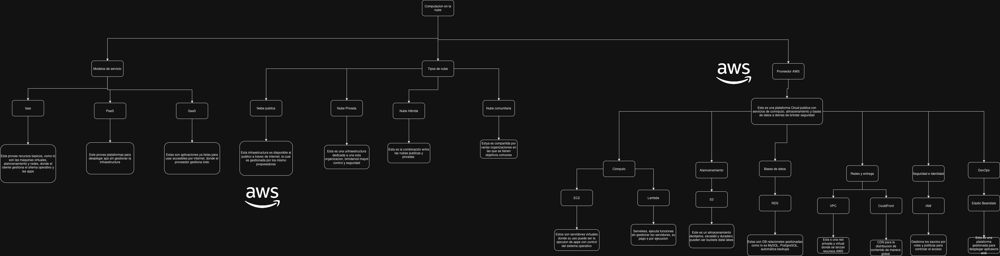

Mapa Conceptual de AWS

🗂️ Modelo Conceptual de Servicios AWS

Este documento presenta un mapa conceptual del ecosistema de Amazon Web Services (AWS), organizado por categorías principales. El propósito del modelo es identificar los servicios clave, sus funciones y su relación dentro de la arquitectura de la nube.

A continuación se presentan las cuatro familias de servicios del modelo, cada una con un espacio para agregar los logos de los componentes.

1. ☁️ CÓMPUTO (Compute)

Los servicios de cómputo de AWS permiten ejecutar aplicaciones, máquinas virtuales, contenedores y funciones sin servidor.

Servicios incluidos:
🖥️ Amazon EC2 (Máquinas virtuales)

EC2 permite ejecutar servidores virtuales configurables según RAM, CPU y almacenamiento.

⚡ AWS Lambda (Serverless)

Lambda ejecuta funciones bajo demanda sin administrar servidores.

📦 Amazon ECS / Amazon EKS (Contenedores)

ECS y EKS permiten ejecutar contenedores en arquitecturas escalables.

2. 🧠 BASES DE DATOS (Database)
[Inserta aquí el logo general de Database de AWS]

Servicios para almacenamiento estructurado y no estructurado.

Servicios incluidos:
🛢️ Amazon RDS

Base de datos relacional administrada por AWS.

⚡ Amazon DynamoDB

Base NoSQL completamente gestionada.

🚀 Amazon Aurora

Motor relacional de alto desempeño compatible con MySQL/PostgreSQL.

3. 📦 ALMACENAMIENTO (Storage)

AWS proporciona almacenamiento seguro, escalable y de alta disponibilidad.

Servicios incluidos:
🗃️ Amazon S3

Almacenamiento de objetos con durabilidad de 99.999999999%.

💾 Amazon EBS

Volúmenes de discos persistentes para instancias EC2.

📁 Amazon EFS

Sistema de archivos compartido para múltiples instancias.

4. 🔐 SEGURIDAD (Security & Identity)

Servicios orientados al control de usuarios, permisos, cifrado y protección de redes.

Servicios incluidos:
🛡️ AWS IAM

iam.jpeg

Gestión de usuarios, roles y permisos.

🌐 Amazon VPC

Permite crear redes privadas dentro de AWS.

🔑 AWS KMS

Administración de llaves criptográficas y cifrado.

